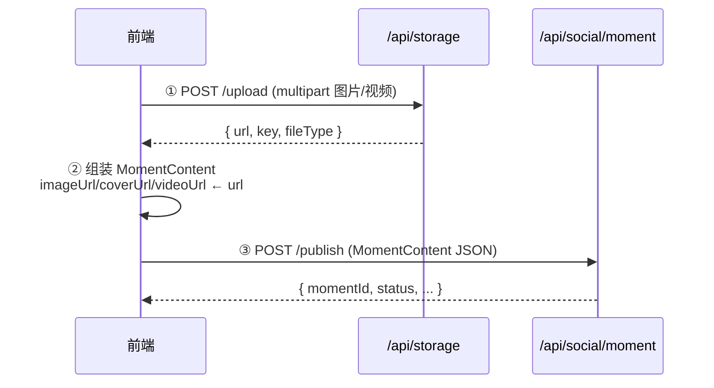

# 文件存储 API 文档

## 目录

1. [通用说明](#1-通用说明)
2. [上传文件](#2-上传文件)
3. [删除文件](#3-删除文件)
4. [生成预签名链接](#4-生成预签名链接)
5. [公共错误码](#5-公共错误码)
6. [附录：与发布流程的集成](#6-附录与发布流程的集成)

---

## 1. 通用说明

### 1.1 认证

所有接口需要登录态，在 **HTTP Header** 中携带 token：

```
token: eyJhbGciOiJSUzI1NiJ9...
```

Token 获取方式：`POST /api/user/login/phone`，见 [login-phone-api.md](login-phone-api.md)。

### 1.2 统一响应结构

```json
{
  "requestId": "xxx",
  "status": 0,
  "state": "OK",
  "content": {},
  "message": "OK"
}
```

详细约定见 [docs/api-struct.md](../api-struct.md)。

### 1.3 HTTP 状态码含义

| HTTP | 含义 | 场景 |
|------|------|------|
| 200 | 成功 | 请求正常处理 |
| 400 | 参数错误 | 文件为空、参数格式错误 |
| 403 | 权限错误 | token 失效 |
| 422 | 业务错误 | 存储平台不可用、文件不存在 |
| 500 | 系统错误 | 服务端未预期异常 |

### 1.4 接口前缀

```
/api/storage
```

---

## 2. 上传文件

### 2.1 接口定义

```
POST /api/storage/upload
```

### 2.2 请求参数

使用 `multipart/form-data` 格式提交。

| 参数 | 类型 | 必填 | 默认值 | 说明 |
|------|------|------|--------|------|
| file | File | 是 | — | 上传的文件（任意类型） |
| platform | String | 否 | — | 存储平台标识（可选，默认使用系统配置） |
| path | String | 否 | `upload` | 存储路径前缀 |

### 2.3 响应参数

**StorageUploadVo**

| 字段 | 类型 | 说明 |
|------|------|------|
| id | Long | 文件记录 ID |
| url | String | **文件访问 URL**（CDN 地址，可直接用于 MomentContent） |
| key | String | 文件在存储桶中的唯一标识（用于删除/预签名） |
| platform | String | 存储平台标识 |
| fileType | String | 文件扩展名（如 `jpg`、`png`、`mp4`） |

### 2.4 响应示例

```json
{
  "requestId": "322655903800561710",
  "status": 0,
  "state": "OK",
  "content": {
    "id": 10001,
    "url": "https://cdn.clmcat.com/upload/2026/06/17/abc123.jpg",
    "key": "upload/2026/06/17/abc123.jpg",
    "platform": "oss",
    "fileType": "jpg"
  },
  "message": "OK"
}
```

### 2.5 curl 示例

```bash
# 上传图片
curl -X POST http://localhost:8080/api/storage/upload \
  -H "token: <token>" \
  -F "file=@/path/to/photo.jpg" \
  -F "path=moment"

# 上传视频
curl -X POST http://localhost:8080/api/storage/upload \
  -H "token: <token>" \
  -F "file=@/path/to/video.mp4" \
  -F "path=moment/video"
```

### 2.6 常见错误

| 错误码 | HTTP | 说明 |
|--------|------|------|
| 300004 | 400 | file 为空 |
| 100003 | 403 | token 失效 |
| 400002 | 422 | 上传失败（存储服务异常） |

---

## 3. 删除文件

### 3.1 接口定义

```
POST /api/storage/delete
```

### 3.2 请求参数

| 参数 | 类型 | 必填 | 说明 |
|------|------|------|------|
| key | String | 是 | 上传时返回的 `key`（文件唯一标识） |
| platform | String | 否 | 存储平台（可选） |

### 3.3 响应

返回 `true` 表示删除成功。

### 3.4 curl 示例

```bash
curl -X POST "http://localhost:8080/api/storage/delete?key=upload/2026/06/17/abc123.jpg" \
  -H "token: <token>"
```

### 3.5 常见错误

| 错误码 | HTTP | 说明 |
|--------|------|------|
| 300004 | 400 | key 为空 |
| 100003 | 403 | token 失效 |
| 400003 | 422 | 文件不存在 |
| 400002 | 422 | 删除失败 |

---

## 4. 生成预签名链接

### 4.1 接口定义

```
GET /api/storage/presign
```

### 4.2 请求参数

| 参数 | 类型 | 必填 | 默认值 | 说明 |
|------|------|------|--------|------|
| key | String | 是 | — | 文件唯一标识 |
| expireSeconds | Long | 否 | `3600` | 链接有效期（秒） |
| platform | String | 否 | — | 存储平台（可选） |

### 4.3 响应参数

**PresignResultVo**

| 字段 | 类型 | 说明 |
|------|------|------|
| url | String | 预签名临时访问 URL（含过期时间戳） |
| expireSeconds | long | 有效期（秒） |

### 4.4 响应示例

```json
{
  "requestId": "322655903800561711",
  "status": 0,
  "state": "OK",
  "content": {
    "url": "https://cdn.clmcat.com/upload/2026/06/17/abc123.jpg?OSSAccessKeyId=...&Expires=...&Signature=...",
    "expireSeconds": 3600
  },
  "message": "OK"
}
```

### 4.5 curl 示例

```bash
curl -X GET "http://localhost:8080/api/storage/presign?key=upload/2026/06/17/abc123.jpg&expireSeconds=1800" \
  -H "token: <token>"
```

### 4.6 常见错误

| 错误码 | HTTP | 说明 |
|--------|------|------|
| 300004 | 400 | key 为空 |
| 100003 | 403 | token 失效 |
| 400003 | 422 | 文件不存在 |

---

## 5. 公共错误码

| 错误码 | HTTP | state | 说明 |
|--------|------|-------|------|
| 0 | 200 | OK | 处理成功 |
| 300004 | 400 | P_VALUE_ERROR | 参数值校验不通过 |
| 100003 | 403 | AUTH_TOKEN_INVALID | token 失效 |
| 400001 | 422 | R_ERROR | 业务异常（通用） |
| 400002 | 422 | R_OPERATION_FAIL | 操作失败 |
| 400003 | 422 | R_NOEXIST_DATA | 数据不存在 |
| 500 | 500 | SYSTEM_ERROR | 系统内部错误 |

---

## 6. 附录：与发布流程的集成

### 6.1 完整发布流程



### 6.2 字段对照

上传返回字段 → MomentContent 对应位置：

| 上传返回 | 内容类型 | MomentContent 位置 |
|---------|---------|-------------------|
| `url` (图片) | image | `content.image[].imageUrl` |
| `url` (视频) | video | `content.video.videoUrl` |
| `url` (视频封面) | video | `content.video.coverUrl` |
| `fileType` | — | 用于前端判断 type 类型 |

### 6.3 实践建议

| 场景 | 建议 |
|------|------|
| 图片上传路径 | `path=moment/image` |
| 视频上传路径 | `path=moment/video` |
| 上传后取消发布 | 调用 `/delete` 清除已上传文件 |
| 私有文件访问 | 上传返回的 `url` 已是 CDN 地址，直接可用；如需临时授权访问私有文件，调 `/presign` |

### 6.4 相关文档

| 文档 | 说明 |
|------|------|
| [moment-publish-api.md](moment-publish-api.md) | 动态发布 API |
| [social-feed-api.md](social-feed-api.md) | Feed 推荐流、评论、点赞 API |
